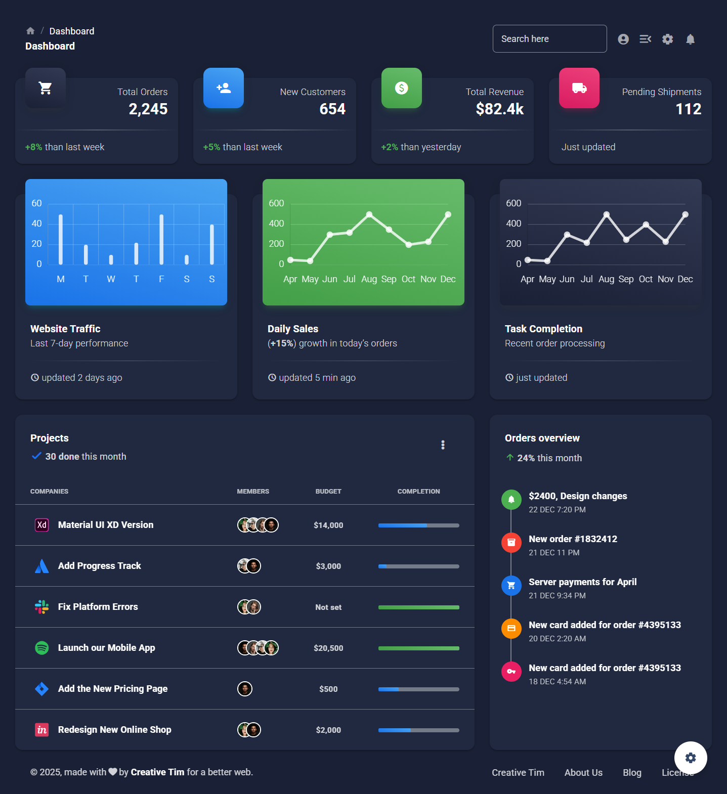

# 🚀 Material Dashboard 2 React — Customized by Abdul Ahad

---

## 🧠 About This Project

This project reflects my **learning and customization skills** as a frontend developer. I enhanced Creative Tim’s template into a **fully personalized dark-themed admin panel** with cleaner UI, better responsiveness, and branding.  

> Proudly developed by **Abdul Ahad** — combining design sense, coding, and deployment skills.

---

## ✨ Features

- 🌙 Default Dark Theme  
- 🎨 Material UI v5 Styling  
- 🧩 Modular React Components  
- 📱 Responsive Across All Devices  
- 📊 Real-Time Dashboard Widgets  
- ⚙️ Clean Code & Easy Customization  

---

## 🧑‍💻 Developer Info

- **Name**: Abdul Ahad  
- **Email**: [ahadking6152@gmail.com](mailto:ahadking6152@gmail.com)  
- **GitHub**: [@abdulahad-2](https://github.com/abdulahad-2)  
- **Live Site**: [Dashboard on GitHub Pages](https://abdulahad-2.github.io/admin-dashboard/)
